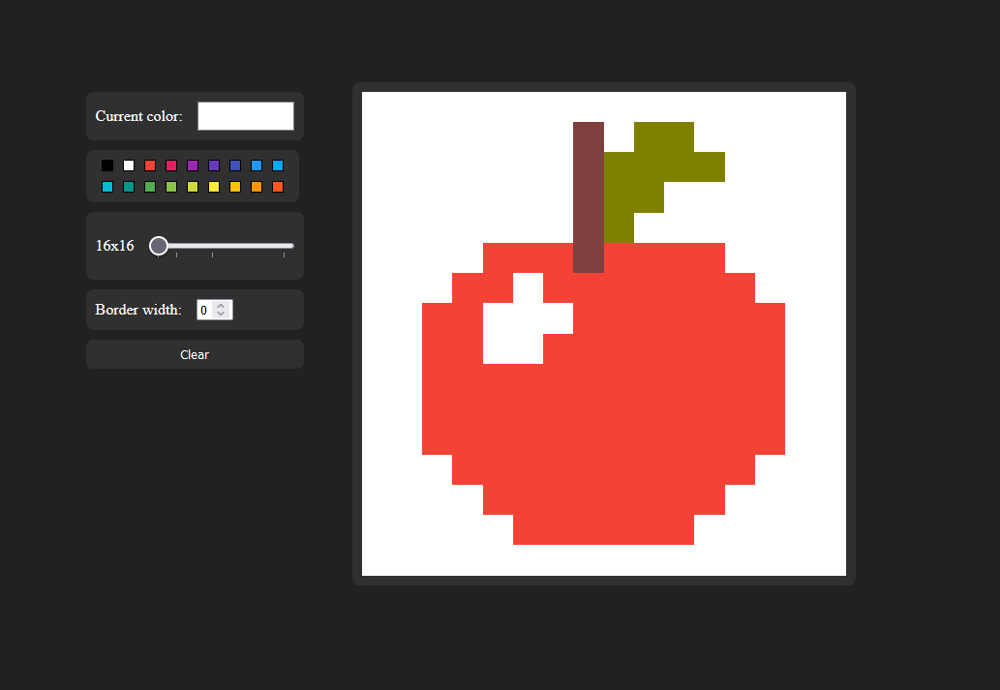

# WebSketch Project

## About

This Etch-A-Sketch project is a simple web-based drawing application created as part of The Odin Project's curriculum. It provides a fun and interactive way to draw and explore your artistic skills in the digital world. Whether you're an aspiring artist or just looking to relax and doodle, this project is for you!

## Features

- Interactive drawing canvas.
- Adjustable grid size.
- Eraser mode for precise editing.
- Clear the canvas with a single click.
- Color picker to choose your preferred drawing color.

## Demo

Check out a live demo of the Etch-A-Sketch project [here](https://thecodegeneral.github.io/WebSketch/).

